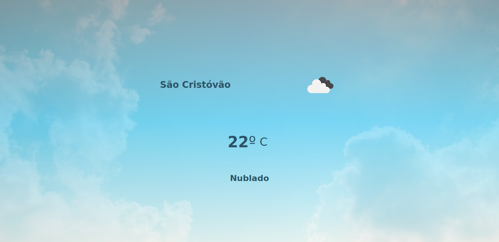

# What's this project?
It's a Weather app build as a educational project and used to improve my web development skills.

# What technologies was used in this project?
This project was build using the following technologies:
+ HTML5
+ CSS3
+ Javascript

# Who's the weather data provider?
The weather data is obtained from the Api made available by [Openweathemap.org](https://openweathermap.org/api)

# A little preview!
